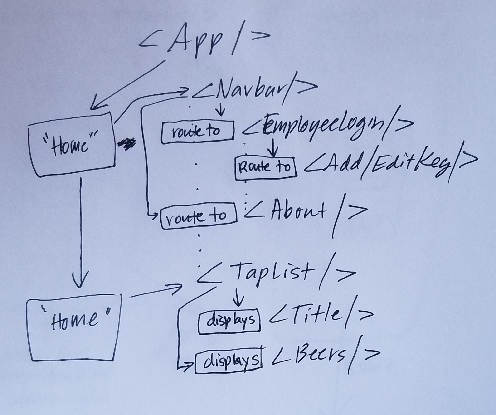

#  Higlander Tap House

#### By Megan Schulte 7-4-2019

## Description

  This web application is designed to be both a tap room beer list for customers and a keg tracking app for the eployees of said tap room. It is created using React and supporting tools. 

## Setup/Installation Requirements
* clone project from https://github.com/meganschultepdx/highlander-tap-house.
* Run npm install from with in root directory to install necessary packages.
* Run ng run start --open to open project on Local Server.
* Project will automatically open in Chrome browser at localhost:8080

## Component Tree/Project Planning

## Features

Below are the current features worked on today and the features that are planned for future developement.

# Current Features:

* home page with:
  - navbar component
    - click on "Employee Login "in navbar to route to fake employee login page
    - click on "About" in footer to route to about page
    - click on Home to route back home from other pages.
    - Navbar and its links to show on every "page" or when other components are displayed.
  - List of Kegs that is a kegList component that holds a hard-coded list of current kegs and uses a child kegs component to display each individual keg.
* Employee Login page has fake login form but 'login" button routes you to Add/edit keg page.
* Add/Edit keg component page has form that allows employees to add/edit current kegs.
* styling with css modules and webpack bundled images

 ## Known Bugs

  No known bugs

  ## Support and contact details

  Create a pull request on GitHub.

  ## Technologies Used

  * JavaScript
  * React
  * Html
  * Webpack
  * npm
  * CSS
  * Material-UI

  ### License

  GPL, keep information free.

  Copyright (c) 2019 Megan Schulte
