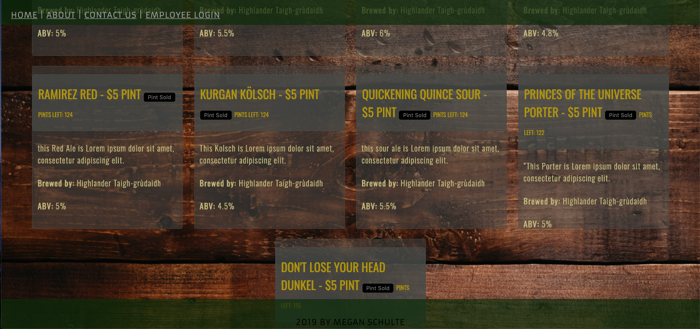

# Higlander Tap House

#### By Megan Schulte 7-4-2019

## Description

This web application is designed to be both a tap room beer list for customers and a keg tracking app for the eployees of said tap room. It is created using React and supporting tools.

## Setup/Installation Requirements

- clone project from https://github.com/meganschultepdx/highlander-tap-house.
- Run \$npm install from with in root directory to install necessary packages.
- Run \$npm start to open project on Local Server.
- Navigate to localhost:8080 in Google Chrome.

## Component Tree/Project Planning

## Features

Below are the current features worked on today and the features that are planned for future developement.

# Current Features:

- home page with:
  - navbar component
    - click on "Employee Login "in navbar to route to fake employee login page
    - click on "About" in footer to route to about page
    - click on Home to route back home from other pages.
    - click on Contact to route to page with Contact info.
    - Navbar and its links to show on every "page" or when other components are displayed.
  - List of Kegs that is a kegList component that holds a hard-coded list of current kegs and uses a child kegs component to display each individual keg. You can also navigate through EmloyeeLogin page to EmployeePage to add new kegs to the list.
- Employee Login page has fake login form but 'login" button routes you to Employee Page.
- Employee page displays employee keg list that reuses KegList and Keg components but uses conditional path display to show number of pints left and sold pint button that has an event listener to decrement total pints.
- Employee page also renders AddKeg comp that allows user to add new keg tot this list.
- styling with css modules and webpack bundled images

## Known Bugs

No known bugs

## Support and contact details

Create a pull request on GitHub.

## Technologies Used

- JavaScript
- React
- Html
- Webpack
- npm
- CSS
- Material-UI

### License

GPL, keep information free.

Copyright (c) 2019 Megan Schulte
